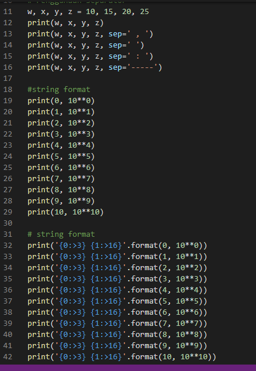
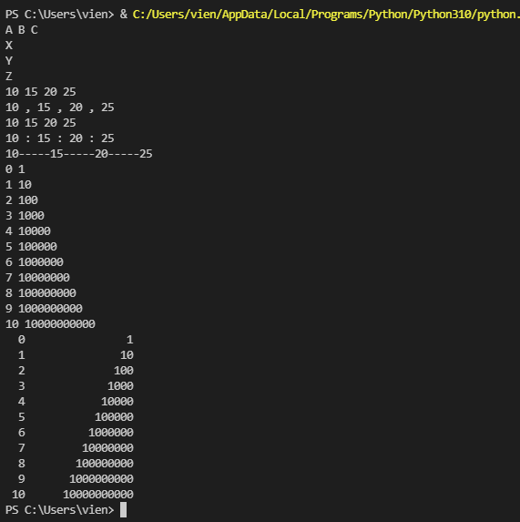
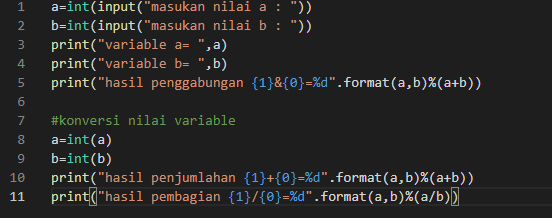
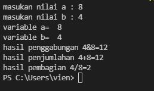
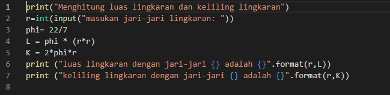
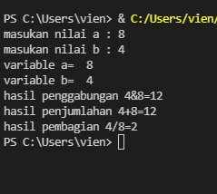
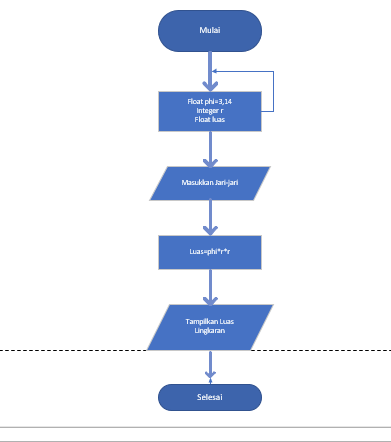

# Praktikum2
# NAMA : DODOT GUNTUR SATRIA PUTRA
# NIM : 312110499
# KELAS : TI.21.C1
# TUGAS BAHASA PEMOGRAMAN
# PROGAM PENGGUNAAN END, SEPARATOR, STRING FORMAT

 Buat program seperti berikut 

 maka hasil run seperti berikut 

# MEMBUAT PROGRAM PENJUMLAHAN DAN PEMBAGIAN

 Buat program seperti berikut 

 maka hasil run seperti berikut 

# MEMBUAT PROGRAM HITUNG KELILING DAN LUAS LINGKARAN

 Buat program seperti berikut 

 maka hasil run seperti berikut 

 flowchartnya seperti berikut 

# TERIMA KASIH